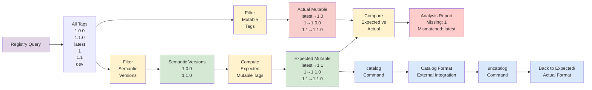

# Equilibrium

[](https://badge.fury.io/rb/equilibrium)
[](https://github.com/TonyCTHsu/equilibrium/actions)
[](https://opensource.org/licenses/MIT)

A container image tool that validates equilibrium between mutable tags and semantic version tags.

## Table of Contents

- [The Problem](#the-problem)
- [How Equilibrium Solves It](#how-equilibrium-solves-it)
- [Tag Conversion Logic](#tag-conversion-logic)
- [Installation](#installation)
- [Quick Start](#quick-start)
- [Output Formats & Schemas](#output-formats--schemas)
- [Constraints](#constraints)
- [License](#license)

## The Problem

Container registries create a web of mutable tags that should point to specific semantic versions, but these relationships can break over time:

**The Challenge:**
- When you publish `myapp:1.2.3`, registries should automatically create `myapp:latest`, `myapp:1`, `myapp:1.2`
- But what happens when you later publish `myapp:1.2.4` or `myapp:1.3.0`?
- Do all the mutable tags get updated correctly?
- How do you verify the entire tag ecosystem is in equilibrium?

**Real-World Impact:**
- `latest` might point to an outdated version
- Major version tags like `1` might miss recent patches
- Minor version tags like `1.2` might not reflect the latest patch
- Users pulling `myapp:1` expect the latest `1.x.x`, but get an old version

## How Equilibrium Solves It

Equilibrium validates your container registry's tag ecosystem through a clear data flow:



**Process Steps:**
1. **Fetch All Tags**: Query registry for complete tag list
2. **Filter Semantic**: Extract only valid semantic version tags (MAJOR.MINOR.PATCH)
3. **Compute Expected**: Generate mutable tags based on semantic versions
4. **Fetch Actual**: Query registry for current mutable tag state
5. **Compare & Analyze**: Identify missing, unexpected, and mismatched tags with unified structure
6. **Format Conversion**: Transform between expected/actual and catalog formats for external integration

## Installation

```bash
gem install equilibrium
```

For containerized environments, use the Docker image:

```bash
# Pull the latest version
docker pull ghcr.io/tonycthsu/equilibrium:latest
```

*For other installation methods, see `equilibrium help`*

## Quick Start

```bash
REPO="gcr.io/datadoghq/apm-inject"
# 1. Check what mutable tags should exist
equilibrium expected "$REPO"

# 2. Check what mutable tags actually exist
equilibrium actual "$REPO"

# 3. Compare and analyze differences
equilibrium expected "$REPO" --format json > expected.json
equilibrium actual "$REPO" --format json > actual.json
equilibrium analyze --expected expected.json --actual actual.json

# 4. Convert to catalog format and back (Round trip)
equilibrium catalog expected.json  | tee catalog.json
equilibrium uncatalog catalog.json | tee uncatalog.json
```

*For detailed command options, run `equilibrium help [command]`*

## Tag Conversion Logic

Equilibrium transforms semantic version tags into their expected mutable tag ecosystem:

### Core Principle
For any semantic version `MAJOR.MINOR.PATCH`, create mutable tags for each component level, pointing to the **highest available version** at that level.

### Detailed Examples

**Scenario 1: Single Version**
```
Semantic versions: ["1.0.0"]

Expected mutable tags:
├── latest → 1.0.0    (highest overall)
├── 1      → 1.0.0    (highest major 1)
└── 1.0    → 1.0.0    (highest minor 1.0)
```

**Scenario 2: Multiple Patch Versions**
```
Semantic versions: ["1.0.0", "1.0.1", "1.0.2"]

Expected mutable tags:
├── latest → 1.0.2    (highest overall)
├── 1      → 1.0.2    (highest major 1)
└── 1.0    → 1.0.2    (highest minor 1.0)
```

**Scenario 3: Multiple Minor Versions**
```
Semantic versions: ["1.0.0", "1.0.1", "1.1.0", "1.1.3"]

Expected mutable tags:
├── latest → 1.1.3    (highest overall)
├── 1      → 1.1.3    (highest major 1)
├── 1.0    → 1.0.1    (highest minor 1.0)
└── 1.1    → 1.1.3    (highest minor 1.1)
```

**Scenario 4: Multiple Major Versions**
```
Semantic versions: ["0.9.0", "1.0.0", "1.2.3", "2.0.0", "2.1.0"]

Expected mutable tags:
├── latest → 2.1.0    (highest overall)
├── 0      → 0.9.0    (highest major 0)
├── 0.9    → 0.9.0    (highest minor 0.9)
├── 1      → 1.2.3    (highest major 1)
├── 1.0    → 1.0.0    (highest minor 1.0)
├── 1.2    → 1.2.3    (highest minor 1.2)
├── 2      → 2.1.0    (highest major 2)
├── 2.0    → 2.0.0    (highest minor 2.0)
└── 2.1    → 2.1.0    (highest minor 2.1)
```

**Scenario 5: Pre-release and Non-semantic Tags (Filtered Out)**
```
All tags: ["1.0.0", "1.1.0-beta", "1.1.0-rc1", "1.1.0", "latest", "dev"]
Semantic versions: ["1.0.0", "1.1.0"]  # Pre-releases and existing mutable tags filtered

Expected mutable tags:
├── latest → 1.1.0    (highest overall)
├── 1      → 1.1.0    (highest major 1)
├── 1.0    → 1.0.0    (highest minor 1.0)
└── 1.1    → 1.1.0    (highest minor 1.1)
```

## Output Formats & Schemas

### JSON Format
All commands output structured JSON following validated schemas (see [schemas](lib/equilibrium/schemas/)):

**Expected/Actual Commands** ([schema](lib/equilibrium/schemas/expected_actual.rb)):
```json
{
  "repository_url": "gcr.io/project/image",
  "repository_name": "image",
  "digests": {
    "latest": "sha256:5fcfe7ac14f6eeb0fe086ac7021d013d764af573b8c2d98113abf26b4d09b58c",
    "1": "sha256:5fcfe7ac14f6eeb0fe086ac7021d013d764af573b8c2d98113abf26b4d09b58c",
    "1.2": "sha256:5fcfe7ac14f6eeb0fe086ac7021d013d764af573b8c2d98113abf26b4d09b58c"
  },
  "canonical_versions": {
    "latest": "1.2.3",
    "1": "1.2.3",
    "1.2": "1.2.3"
  }
}
```

**Analyze Command** ([schema](lib/equilibrium/schemas/analyzer_output.rb)):
```json
{
  "repository_url": "gcr.io/project/image",
  "repository_name": "image",
  "expected_count": 3,
  "actual_count": 2,
  "missing_tags": {
    "1.2": {
      "expected": "sha256:abc123ef456789012345678901234567890123456789012345678901234567890",
      "actual": ""
    }
  },
  "unexpected_tags": {
    "dev": {
      "expected": "",
      "actual": "sha256:xyz789ab123456789012345678901234567890123456789012345678901234"
    }
  },
  "mismatched_tags": {
    "latest": {
      "expected": "sha256:def456ab789123456789012345678901234567890123456789012345678901",
      "actual": "sha256:old123ef456789012345678901234567890123456789012345678901234567890"
    }
  },
  "status": "missing_tags"
}
```

#### Unified Tag Structure

All tag analysis results (`missing_tags`, `unexpected_tags`, `mismatched_tags`) use a consistent structure:

- **`missing_tags`**: Tags that should exist but don't
  - `expected`: The SHA256 digest the tag should point to
  - `actual`: Empty string (tag doesn't exist)

- **`unexpected_tags`**: Tags that exist but shouldn't
  - `expected`: Empty string (tag shouldn't exist)
  - `actual`: The SHA256 digest the tag currently points to

- **`mismatched_tags`**: Tags that exist but point to wrong digest
  - `expected`: The SHA256 digest the tag should point to
  - `actual`: The SHA256 digest the tag currently points to

This unified structure makes programmatic processing easier and provides clear semantics about what was expected versus what was actually found.

**Catalog Command** ([schema](lib/equilibrium/schemas/catalog.rb)):
```json
{
  "repository_url": "gcr.io/project/image",
  "repository_name": "image",
  "images": [
    {
      "tag": "latest",
      "digest": "sha256:5fcfe7ac14f6eeb0fe086ac7021d013d764af573b8c2d98113abf26b4d09b58c",
      "canonical_version": "1.2.3"
    },
    {
      "tag": "1",
      "digest": "sha256:5fcfe7ac14f6eeb0fe086ac7021d013d764af573b8c2d98113abf26b4d09b58c",
      "canonical_version": "1.2.3"
    },
    {
      "tag": "1.2",
      "digest": "sha256:5fcfe7ac14f6eeb0fe086ac7021d013d764af573b8c2d98113abf26b4d09b58c",
      "canonical_version": "1.2.3"
    }
  ]
}
```

**Uncatalog Command**: Converts catalog format back to expected/actual format (same schema as expected/actual commands).

### Summary Format
Human-readable table format for quick visual inspection.

## Constraints

- **Registry Support**: Public Google Container Registry (GCR) only
- **Tag Format**: Only processes semantic version tags (MAJOR.MINOR.PATCH)
- **URL Format**: Requires full repository URLs: `[REGISTRY_HOST]/[NAMESPACE]/[REPOSITORY]`

### Local Image Build

To build the Docker image locally, you need the gem artifact in the `pkg/` directory:

```bash
# Build the gem using the same method as CI
bundle exec rake clobber  # Clean previous builds
bundle exec rake build    # Rebuild gem

# Build image
podman build -f docker/Dockerfile -t equilibrium:local .

# Test the local build
podman run --rm localhost/equilibrium:local equilibrium version
```

**Note**: The Dockerfile expects the gem artifact in `pkg/*.gem`. Using `bundle exec rake build` ensures you build the gem exactly the same way as the CI pipeline.

## Development

### Prerequisites

- **Ruby** (>= 3.0.0) with Bundler
- **No authentication required** for public Google Container Registry (GCR) access
- **Pure Ruby implementation** - uses only Ruby standard library (Net::HTTP) for HTTP requests

### Code Quality

```bash
# Ruby linting
bundle exec standardrb
bundle exec standardrb --fix

# Run tests
bundle exec rspec
```

### Release Process

To create a new release:

```bash
# Update version in lib/equilibrium/version.rb, then:
./bin/release
```

The script automatically:
1. Reads the version from `equilibrium.gemspec`
2. Creates a git tag with `v` prefix (e.g., `v0.1.1`)
3. Pushes the tag to trigger the automated release workflow

The GitHub Actions workflow validates that the tag version matches the gemspec version before publishing to RubyGems and GitHub Packages.

## License

MIT License - see [LICENSE](LICENSE) file for details.
